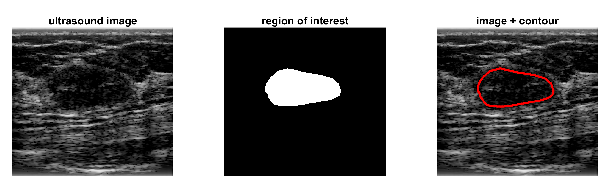

## Morphological features for breast mass characterization (in construction) 

This Matlab repository presents how to extract morphological features based on manually outlined regions of interests (ROIs) from the [OASBUD dataset.](https://zenodo.org/record/545928#.Xy8WzigzaUk)

List of morphological features: 

- breast mass area 
- area ratio
- circularity
- convexity
- depth-to-width ratio
- elliptic normalized circumference
- elliptic normalized skeleton
- long-to-short axis ratio 
- mass orientation
- normalized residual value
- roundness 
- normalized radial length area ratio
- normalized radial length contour roughness
- normalized radial length mean
- normalized radial length standard deviation

The listed features were investigated in the following papers: 
- [Chen et al. Breast lesions on sonograms: computer-aideddiagnosis  with  nearly  setting-independent  features  and  artificial  neuralnetworks. Radiology, 2003.](https://doi.org/10.1148/radiol.2262011843)
- [Shen et al. Breast ultrasound computer-aided diagnosis using BI-RADS features. Academic Radiology, 2007.](https://doi.org/10.1016/j.acra.2007.04.016)
- [Alvarenga et al. Assessing the performance of morphological parameters in distinguishing breast tumors on ultrasound images. Medical Engineering & Physics, 2010,](https://doi.org/10.1016/j.medengphy.2009.10.007) 
- [Flores et al. Improving classification performance of breast lesions on ultrasonography. Pattern Recognition, 2015.](https://doi.org/10.1016/j.patcog.2014.06.006)

# About

If you find this site useful for your work, consider citing the following papers: 

[Byra et al. Early prediction of response to neoadjuvant chemotherapy in breastcancer sonography using Siamese convolutional neural networks. IEEE Journal of Biomedical and Health Informatics, 2020.](https://doi.org/10.1109/JBHI.2020.3008040)

[Piotrzkowska-Wroblewska et al. Open access database of raw ultrasonic signals acquired from malignant and benign breast lesions. Medical Physics, 2017.](https://doi.org/10.1002/mp.12538)

e-mail: byra.michal@gmail.com

# Acknowledgement

We used the publically available Matlab code for ellipse fitting: 

Ohad Gal (2020). fit_ellipse (https://www.mathworks.com/matlabcentral/fileexchange/3215-fit_ellipse), MATLAB Central File Exchange. 
